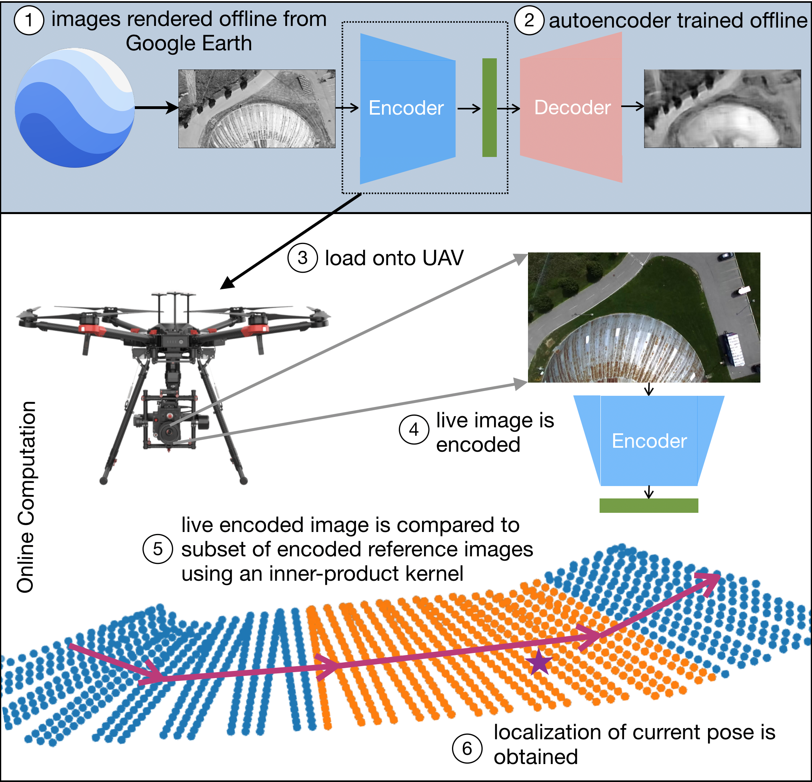

#### Kelvin Leung
***

# Education 

<table style="width:100%">
  <tr>
    <td> 
      <b> Master of Science in Aeronautics and Astronautics </b>  
      <a href="https://uqgroup.mit.edu/">Uncertainty Quantification Group</a>, <a href="https://acdl-web.mit.edu/">Aerospace Computational Design Laboratory</a>  
      <i> Massachusetts Institute of Technology, 2019 - 2021 </i>    
      <b> Bachelor of Applied Science in Engineering Science with High Honours </b>  
      <i> University of Toronto, Major in Aerospace Engineering, 2015 - 2019 </i>  
      <a href="https://www.linkedin.com/in/kelvin-leung-82641550/">View my LinkedIn Profile</a> &nbsp; 
      <a href="https://github.com/kelvinmleung">View my GitHub Profile</a> &nbsp; 
      <a href="assets/pdfs/KelvinLeungResume.pdf">Download my Resume</a>   &nbsp; 
    </td>
    <td>

 </td>     
  </tr>
</table>

# Projects

## Accelerated Bayesian computation for global imaging spectroscopy

<table style="width:100%">
  <colgroup>
       <col span="1" style="width: 60%;">
       <col span="1" style="width: 40%;">
    </colgroup>
  <tbody>
    <tr>
      <td> 
        Blah Blah MCMC current research BOORINGG
      </td>
      <td>
        

         
        

      </td>
    </tr>
  </tbody>
  </table>

## Can Sorting Machine

For an undergraduate engineering design course, my team designed and constructed a fully autonomous machine that is capable of sorting cans for recycling. There were four categories of cans: tin cans with label, tin cans without label, aluminum cans with tab, and aluminum cans without tab.  Our machine used a dual level approach to first sort based on size. The upper level contained cutouts to allow the aluminum cans to fall to the lower level. A camshaft was used to shake both levels to separate the tin and aluminum cans, which then travelled into their respective chutes. At the bottom of the chute for tin cans, the presence or absence of a paper label on each can was evaluated using conductive thread. At the bottom of chute for aluminum cans, the presence or absence of a tab was detected using flex sensors. Based on the sensor data, the cans were dropped into the appropriate bucket. I was the electrical member, responsible for the implementation of digital and analog interfacing electronics, including circuit design and sensor selection and implementation, and integrating with my electromechanical and microcontroller team members. Our machine placed <b>1st</b> in the full semster course competition based on both performance and design.



 

 

# Other Research

<table style="width:100%">
  <colgroup>
       <col span="1" style="width: 50%;">
       <col span="1" style="width: 50%;">
    </colgroup>
  <tbody>
    <tr>
      <td> 
      <b> Research Assistant &nbsp; &nbsp; &nbsp; Summer 2018 </b>  
<i>University of Michigan </i>  
  <ul>
   <li>item 1 </li>
   <li>Item 2 </li>
  </ul>

<b> Research Intern &nbsp; &nbsp; &nbsp; Summer 2017 </b>  
<i>Germany Aerospace Center (DLR) </i>  
<ul>
   <li>item 1 </li>
   <li>Item 2 </li>
  </ul>
  
  <b> Research Assistant &nbsp; &nbsp; &nbsp; Summer 2016 </b>  
<i> University of Toronto Institute for Aerospace Studies </i>  
<ul>
   <li>item 1 </li>
   <li>Item 2 </li>
  </ul>

   </td>
      <td>
        

            
        

      </td>
    </tr>
  </tbody>
  </table>

<!-- # Fun Stuff
 !-->

