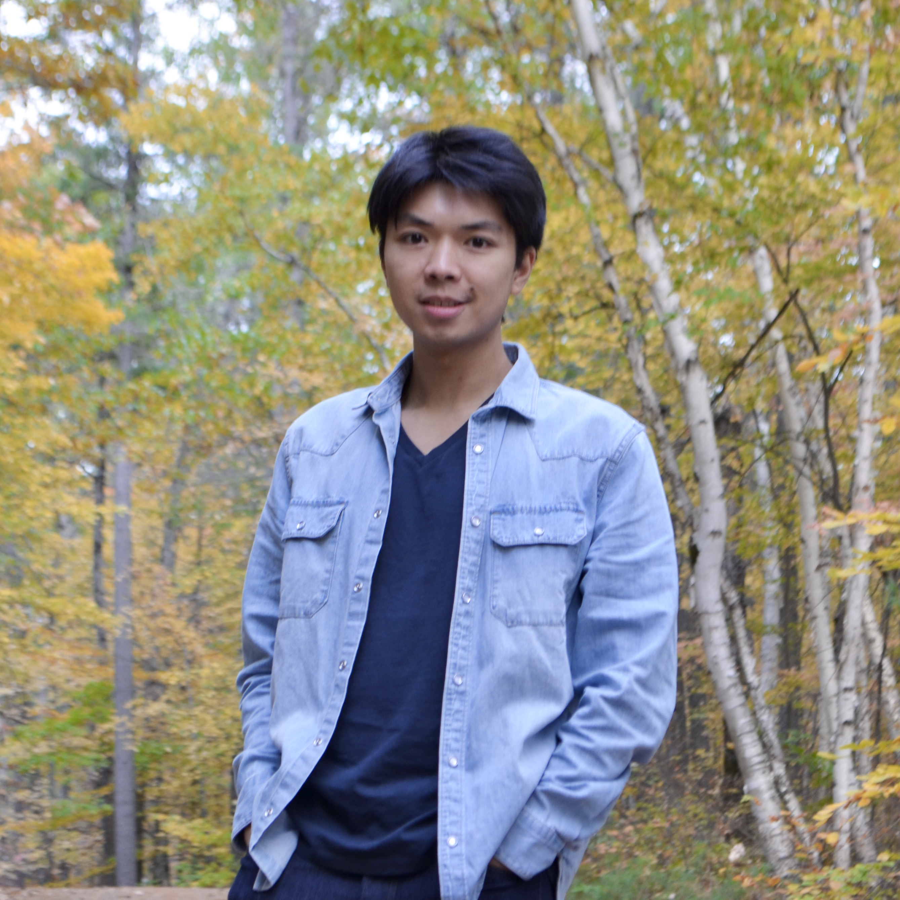
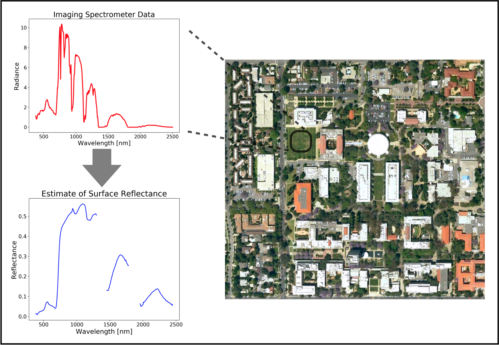
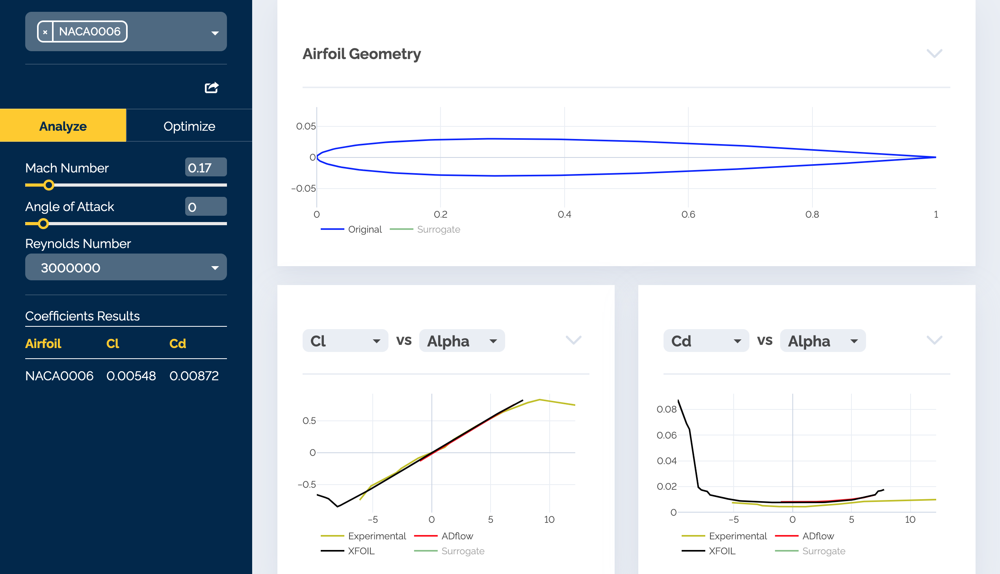

#### Kelvin Leung
***

<table style="width:100%">
  <tr>
    <td> 
       
      Hi, I’m Kelvin! With a background in aerospace engineering, I’m currently pursing my Master's and doctorate as part of the <a href="https://uqgroup.mit.edu/" target="_blank">Uncertainty Quantification group</a> at MIT, supervised by Professor Youssef Marzouk. I can be reached by email at <a href = "mailto: kmleung@mit.edu">kmleung@mit.edu</a>. 
         
      <a href="https://www.linkedin.com/in/kelvin-leung-82641550/" target="_blank" class="button">View my LinkedIn</a> &nbsp; &nbsp;
      <a href="https://github.com/kelvinmleung" target="_blank" class="button">View my Github</a> &nbsp; &nbsp;
      <a href="assets/pdfs/KelvinLeungResume.pdf" target="_blank" class="button">Download my Resume</a> &nbsp; &nbsp;
          
    </td>
    <td>

 </td>     
  </tr>
</table>

# Education 

<b> Master of Science in Aeronautics and Astronautics </b>  
<a href="https://uqgroup.mit.edu/" target="_blank">Uncertainty Quantification Group</a>, <a href="https://acdl-web.mit.edu/" target="_blank">Aerospace Computational Design Laboratory</a>  
<i> Massachusetts Institute of Technology  &nbsp; &nbsp; &nbsp;   2019 - 2021 </i>    
<b> Bachelor of Applied Science in Engineering Science with High Honours </b>  
Major in Aerospace Engineering  
<i> University of Toronto  &nbsp; &nbsp; &nbsp; 2015 - 2019 </i>    

# Projects

 

## Accelerated Bayesian Computation for Global Imaging Spectroscopy

My current research project involves developing Bayesian methods for Earth remote sensing applications, with the goal of mapping the composition and biodiversity of the Earth surface in order to better understand terrestrial and aquatic ecosystems. Given radiance data collected from satellites, the surface reflectance and certain parameters relating to the atmosphere are retrieved through the inverse problem. While current methods are able to return an acceptable point estimate, they do not yield an accurate representation of the uncertainties. In this project, we develop a Bayesian Markov chain Monte Carlo (MCMC) algorithm to retrieve a posterior distribution that better quantifies the uncertainty. Since MCMC requires much more computational power, methods of linearization and dimension reduction are also investigated.
    
<a href="https://github.com/kelvinmleung/MCMCLIS-remotesensing/" target="_blank">View on GitHub</a> 
     
 
   

 

## Webfoil: Airfoil Database, Analysis, and Optimization

During the summer months of 2018, I did research at the University of Michigan MDO lab. We developed a web application called <a href="https://webfoil.engin.umich.edu/">Webfoil</a> that serves as a comprehensive, open-source database of airfoils that includes built-in tools for aerodynamic analysis and optimization. The database includes downloadable information such as geometric coordinates and other airfoil characterstics. One of my contributions was to run various airfoil shapes through CFD software such as Xfoil and ADFlow and compile the lift, drag, and moment data into the database. The analysis tool contains several plots that change based on user input of Reynolds number, Mach number, and angle of attack. The optimization tool uses a surrogate model to generate a new airfoil shape that minimizes drag for a given thickness, Mach number, and coefficient of lift.

       
     

 

 

## Can Sorting Machine

For an undergraduate engineering design course, my team designed and constructed a fully autonomous machine that is capable of sorting cans for recycling. There were four categories of cans: tin cans with label, tin cans without label, aluminum cans with tab, and aluminum cans without tab.  Our machine used a dual level approach to first sort based on size. The upper level contained cutouts to allow the aluminum cans to fall to the lower level. A camshaft was used to shake both levels to separate the tin and aluminum cans, which then travelled into their respective chutes. At the bottom of the chute for tin cans, the presence or absence of a paper label on each can was evaluated using conductive thread. At the bottom of chute for aluminum cans, the presence or absence of a tab was detected using flex sensors. Based on the sensor data, the cans were dropped into the appropriate bucket. I was the electrical member, responsible for the implementation of digital and analog interfacing electronics, including circuit design and sensor selection and implementation, and integrating with my electromechanical and microcontroller team members. Our machine placed <b>1st</b> in the full semster course competition based on both performance and design. 
 


 

# Experience

 
<b> Research Assistant, </b> &nbsp; &nbsp; 2020 - Present 
Project: Accelerated Bayesian computation for global imaging spectroscopy  
<i> Massachusetts Institute of Technology </i>  
 
<b> Teaching Assistant, </b> &nbsp; &nbsp; Fall 2019 
Course: Aerodynamics (16.100) 
<i> Massachusetts Institute of Technology </i>  
 
<b> Teaching Assistant, </b> &nbsp; &nbsp; 2018 - 2019  
Courses: Calculus I & II (MAT187/MAT188)  
<i> University of Toronto </i>  
 
<b> Research Assistant, </b> &nbsp; &nbsp; Summer 2018   
Project: Airfoil analysis and optimization using CFD; Webfoil  
<i> University of Michigan </i>  
 
<b> Research Intern, </b> &nbsp; &nbsp; Summer 2017 
Project: Signal processing methods for aircraft engine acoustics  
<i>German Aerospace Center (DLR) </i>  
 
<b> Research Assistant, </b> &nbsp; &nbsp; Summer 2016  
Project: Propeller performance analysis for UAVs  
<i> University of Toronto Institute for Aerospace Studies </i>

# Music 

<i> “Music is the universal language of mankind.” </i>

<table style="width:100%">
  <tr>
    <td> 
      <iframe src="https://www.youtube.com/embed/tVSJNylOxes" 
        width="400" 
        height="280"
        frameborder="0" 
        allowfullscreen>
    </iframe>  
    </td>
    <td>

       
      I've been playing piano since I was 4. I stopped taking lessons after high school but I try to play whenever I get a chance. This performance was at my sister's wedding a few years ago.
         
      
 </td>     
  </tr>
</table>
<table style="width:100%">
  <tr>
    <td> 
         
      Not long after starting piano, I picked up violin as well. While piano is a nice solo instrument, violin allows me to join ensembles. One of the highlights of my undergrad years was being a part of <a href="https://www.harthouseorchestra.ca/" target="_blank">Hart House Orchestra</a>. We even performed at Carnegie Hall and several beautiful churches in Germany! 
         
      In my spare time, I make covers of the songs that I like listening to. This is one of favourite videos, a song by Hong Kong singer Eason Chan.      
         
    </td>
    <td>

      <iframe src="https://www.youtube.com/embed/00bKj2Cd-As" 
        width="400" 
        height="280"
        frameborder="0" 
        allowfullscreen>
    </iframe>
      
 </td>     
  </tr>
</table>
<table style="width:100%">
  <tr>
    <td> 
      <iframe src="https://www.youtube.com/embed/kEHqc1yWxV0" 
        width="400" 
        height="280"
        frameborder="0" 
        allowfullscreen>
    </iframe>
         
    </td>
    <td>

      A blast from the past, with my love of LEGO as a child. This grand piano set came out in late 2020, and I bought and assembled it right away. It can even connect to your phone and play live music!
      
 </td>     
  </tr>
</table>

