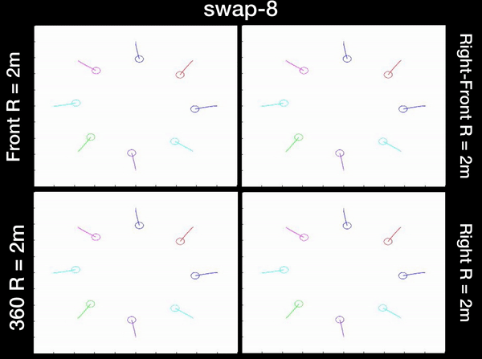
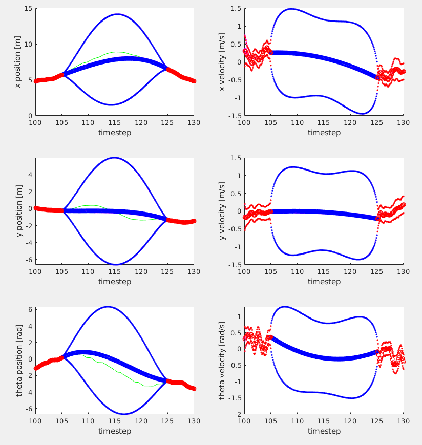

#### Mollie Bianchi
***

# Education 

<table style="width:100%">
  <tr>
    <td> 
      <b> Master of Applied Science, Emphasis in Robotics </b>  
      <i> University of Toronto, Autonomous Space Robotics Lab, GPA: 4.0/4.0, 2019 - 2021</i>  
      <a href="https://news.engineering.utoronto.ca/five-u-of-t-engineering-students-recognized-with-vector-institute-scholarships-in-ai/">Vector Scholarship in Artificial Intelligence</a> and NSERC Graduate Scholarship    
      <b> Bachelor of Applied Science in Engineering Science with High Honours </b>  
      <i> University of Toronto, Robotics Major, GPA: 3.94/4.00, 2015 - 2019 </i>  
      University of Toronto National Scholarship valued at $100k    
      <a href="https://www.linkedin.com/in/mollie-bianchi-4963371a5/">View my LinkedIn Profile</a> &nbsp; 
      <a href="https://github.com/MollieBianchi">View my GitHub Profile</a> &nbsp; 
      <a href="assets/pdfs/MollieBianchiResume.pdf">Download my Resume</a>   &nbsp; 
    </td>
    <td>

 </td>     
  </tr>
</table>

# Projects

## Visual Localization for Unmanned Aerial Vehicles

<table style="width:100%">
  <colgroup>
       <col span="1" style="width: 60%;">
       <col span="1" style="width: 40%;">
    </colgroup>
  <tbody>
    <tr>
      <td> 
        My current research area is on visual localization for unmanned aerial vehicles (UAVs). I recently proposed and demonstrated a fast, robust method for using satellite images for localization. Previous work using satellite images has large storage and computation costs and is unable to run in real time. In this work, Google Earth (GE) images were collected for a desired flight path offline and an autoencoder was trained to compress these images to a low-dimensional vector representation while retaining the key features. This trained autoencoder is used to compress a real UAV image, which is then compared to the precollected, nearby, autoencoded GE images using an inner-product kernel. This results in a distribution of weights over the corresponding GE image poses and is used to generate a single localization and associated covariance to represent uncertainty. The proposed localization method is computed in 1% of the time of the current standard and is able to achieve a comparable RMSE of less than 3m in the experiments, where UAV images from six runs spanning the lighting conditions of a single day were robustly matched to the same map of satellite images. This paper has been submitted to the International Conference on Robotics and Automation 2021.
      </td>
      <td>
        

         
        

      </td>
    </tr>
  </tbody>
  </table>

## Simulation Testing for aUToronto, [UofT's Self Driving Car Team](https://www.autodrive.utoronto.ca)

For the last three years, I have been a part of UofT's self driving vehicle team, aUToronto. Our team has competed in the intercollegiate, North American AutoDrive competition hosted by the Society of Automotive Engineers and General Motors. We were the 1st Place Team Overall Years [1](https://www.utoronto.ca/news/u-t-s-autoronto-team-wins-first-competition-autodrive-challenge), [2](https://betakit.com/u-of-ts-self-driving-car-dominates-2019-autodrive-challenge/), and [3](https://www.utoronto.ca/news/third-year-running-u-t-engineering-team-wins-international-self-driving-car-challenge). My role was as the Simulation Lead and I was primarily responsible for developing and conducting simulation tests to evaluate the autonomy code. Additionally, I lead our team's efforts on the MathWorks Simulation Challenge of the competition which we placed first in for both the years it was held. One of the environments we used for testing was CARLA, which gave me exposure to using the Unreal Engine and also modelling in Maya. Through this role, I gained experience with developing a complex system as part of a team and working with revision control systems. I also completed my undergradate thesis on this topic, which can be read [here](assets/pdfs/MollieBianchiThesisFinal.pdf). I am one of the authors on the team's systems paper from Year 2 of the competition: [“Zeus: A system description of the two-time winner of the collegiate SAE auto drive competition.”](https://arxiv.org/abs/2004.08752) in the Journal of Field Robotics, 2020. Here is a video showcasing our teams performance in the second year of the competition:



* * *

## Evaluating Preferred Velocity Methods Used with ORCA

<table style="width:100%">
  <colgroup>
       <col span="1" style="width: 60%;">
       <col span="1" style="width: 40%;">
    </colgroup>
  <tbody>
    <tr>
      <td> 
        For my graduate motion planning course, I completed a project evaluating different preferred velocity methods used with ORCA. The <a href="https://gamma.cs.unc.edu/ORCA/">ORCA method </a> is a procedure for finding the closest collision-free velocity to a preferred velocity for each robot in a multi-robot environment. The computation of this preferred velocity is separate from the collision avoidance and is generally achieved using traditional motion planning techniques. The only restriction is that it must be computed quickly as the collision avoidance procedure is computation heavy. Exactly how it was computed was excluded from the original paper. The preferred velocity is important in order to prevent deadlock situations and to ensure smooth paths. This project implements the ORCA method from scratch in MATLAB and presents and evaluates different methods for computing the preferred velocity.  
      <a href="assets/pdfs/PlanningFinalReport.pdf"> Project Report </a> &nbsp;  <a href="https://github.com/MollieBianchi/planning_project"> View on GitHub </a> &nbsp;  <a href="https://youtu.be/DuNtqT4eaR4"> View Video </a>
      </td>
      <td>
        

         
        

      </td>
    </tr>
  </tbody>
  </table>

## Evaluating Efficient Goal Selection Methods for Hindsight Experience Replay

<table style="width:100%">
  <colgroup>
       <col span="1" style="width: 60%;">
       <col span="1" style="width: 40%;">
    </colgroup>
  <tbody>
    <tr>
      <td> 
      In my graduate controls course, I completed a project evaluating the effect of Hindisght Experience Replay (HER) on basic Reinforcement Learning (RL) problems. Often in RL the reward function is a binary signal that depends on whether or not the goal has been reached. Only if the agent achieves the goal does it receive a reward. This means an extremely large amount of samples are required before the agent is able to learn. HER is a method that replays past experiences with a new goal. This has increased the sampling efficiency and practicality of RL on problems with sparse rewards. However, currently the new goals are picked based on a hand-crafted heuristic. This project looks at a new method which selects replay goals that the agent is able to learn the most from. This is achieved by selecting goals that maximize the Bellman error. This method was evaluated on 1D and 2D robotic goal search problems and compared against the existing Future and Final goal selection methods.  
        <a href="assets/pdfs/ControlsFinalReport.pdf"> Project Report </a> &nbsp;  <a href="https://github.com/MollieBianchi/controls_project"> View on GitHub </a> &nbsp;  <a href="https://youtu.be/YPvrOWMDQbc"> View Video </a>
      </td>
      <td>
        

          
        

      </td>
    </tr>
  </tbody>
  </table>

## Localizing from Simulated Data

<table style="width:100%">
  <colgroup>
       <col span="1" style="width: 60%;">
       <col span="1" style="width: 40%;">
    </colgroup>
  <tbody>
    <tr>
      <td> 
      For my graduate perception course, I completed a project on using deep learning methods to localize real images to images generated from a simulated environment. Localization is a key aspect of any self-driving vehicle but relying solely on GPS can result in offsets from a given semantic map. Visual localization is a cost effective solution that works by registering live images with images stored in a map. This work presents a method for finding the 3DoF relative pose change between real images captured at Mcity and simulated geo-referenced images from an Mcity simulation, and is intended for use in a visual localization pipeline. It also investigates the use of synthetic data during training to increase performance.  
        <a href="assets/pdfs/PerceptionFinalReport.pdf">Project Report</a> &nbsp;  <a href="https://youtu.be/qMyTl605iYE"> View Video </a>
      </td>
      <td>
        

          
        

      </td>
    </tr>
  </tbody>
  </table>

## Batch Continuous-Time Trajectory Estimation

<table style="width:100%">
  <colgroup>
       <col span="1" style="width: 60%;">
       <col span="1" style="width: 40%;">
    </colgroup>
  <tbody>
    <tr>
      <td> 
      For my graduate state estimation course, I conducted batch state estimation on two mobile robot datasets using Gaussian process (GP) regression. Measurements are collected at discrete times in this dataset, but by introducing a continuous time prior we are able to represent the trajectory in continuous time. To do so, a two step procedure is employed where first the state is solved for at the measurement times and then interpolation is used to query the trajectory at any additional times of interest. This project also explains how using a special class of prior allows for efficient implementation by exploiting the sparsity of the matrices involved. This is demonstrated by interpolating the state at a constant rate in a linear, one-dimensional problem and a non-linear, two dimensional problem for cases with asynchronous measurement times or prolonged measurement dropout.  
        <a href="assets/pdfs/StateEstimationReportFInal.pdf">Project Report</a>
      </td>
      <td>
        

          
        

      </td>
    </tr>
  </tbody>
  </table>

## Can Sorting Machine
For my undergraduate engeering design course, I was the electromechanical member of a team tasked with designing and constructing a fully autonomous machine capable of separating recyclable cans into four categories: "Tin Cans with Label", "Tin Cans without Label", "Pop Cans with Tab Attached", and "Pop Cans without Tab Attached". Our machine used a dual level approach, first sorting the cans based on size. Cutouts in the floor of the upper level would allow the pop cans to fall to the second level while the larger tin cans remained on the top. Shaking both levels using a cam, the cans would travel onto specially designed chutes to carry them towards the sorted bins. Once reaching the end of their respective chute, the presence or absence of a label on the tin cans was evaluated through the use of conductive thread and the presence or absence of a tab on the pop can was evaluated using flex sensors installed along the chute. Based on this final detection, the can would then be dropped to the side with the correct bin. As the electromehcnaical member I was respobsible for designing and fabricating the machine structure, selecting and installing appropriate sensors, actuators, and motors, and integrating with my electrical and microcontroller team members. Our machine placed <b>1st</b> in the full semster course competition based on both performance and design.



 

 

# Work Experience

<table style="width:100%">
  <colgroup>
       <col span="1" style="width: 50%;">
       <col span="1" style="width: 50%;">
    </colgroup>
  <tbody>
    <tr>
      <td> 
      <b> IT and Controls Intern &nbsp; &nbsp; &nbsp; Summer 2018 </b>  
<i>Innovative Automation Inc., Barrie, Ontario </i>  
  <ul>
   <li>Developed and deployed WinForms and ASP .Net applications in C# for use in production including modifications to the SQL database</li>
   <li>Programmed PLCs for the operation of automated robotic equipment and designed Human Machine Interfaces </li>
   <li>Troubleshot machine operations and rework design during testing phase</li>
  </ul>

<b> IoT App Developer Intern &nbsp; &nbsp; &nbsp;Summer 2017 </b>  
<i>More Automation Solutions Inc., Mississauga, Ontario </i>  
<ul>
   <li>Built Windows Universal Platform and web based applications for industrial IoT products</li>
   <li>Generated databases to store sample records using SQLite  </li>
   <li>Developed accompanying graphical user interfaces for viewing database records using HTML and Angular JS</li>
  <li>Used OpenCV to analyze loaves of bread travelling along a conveyor for quality control</li>
  </ul>

   </td>
      <td>
        

            
        

      </td>
    </tr>
  </tbody>
  </table>

# Fun Stuff


